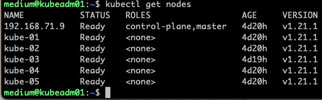

# Setup Binary
```
./setup-kube.sh
```

# Init Cluster
```
./init.sh
```

# Setup Container Network Interface(CNI)
* run this command on master node
* this command will print out kubeadm join command at the end
```
kubectl apply -f calico.yaml
```

# Setup Credential
```
mkdir -p $HOME/.kube
sudo cp -i /etc/kubernetes/admin.conf $HOME/.kube/config
sudo chown $(id -u):$(id -g) $HOME/.kube/config
```


# Join Worker Node
* this is sample command, you can use kubeadm join command printted at the end of kubeadm init  
```
kubeadm join 192.168.66.139:6443 --token abcdef.0123456789abcdef \
	--discovery-token-ca-cert-hash sha256:050c3c31a4cd6766abe9abf88b1b73d0b1e0627d9c013ccfdfa1b45b9d7c927d
```

# Check Cluster
```
kubectl get nodes
```
